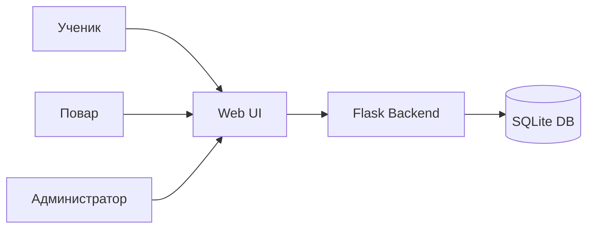
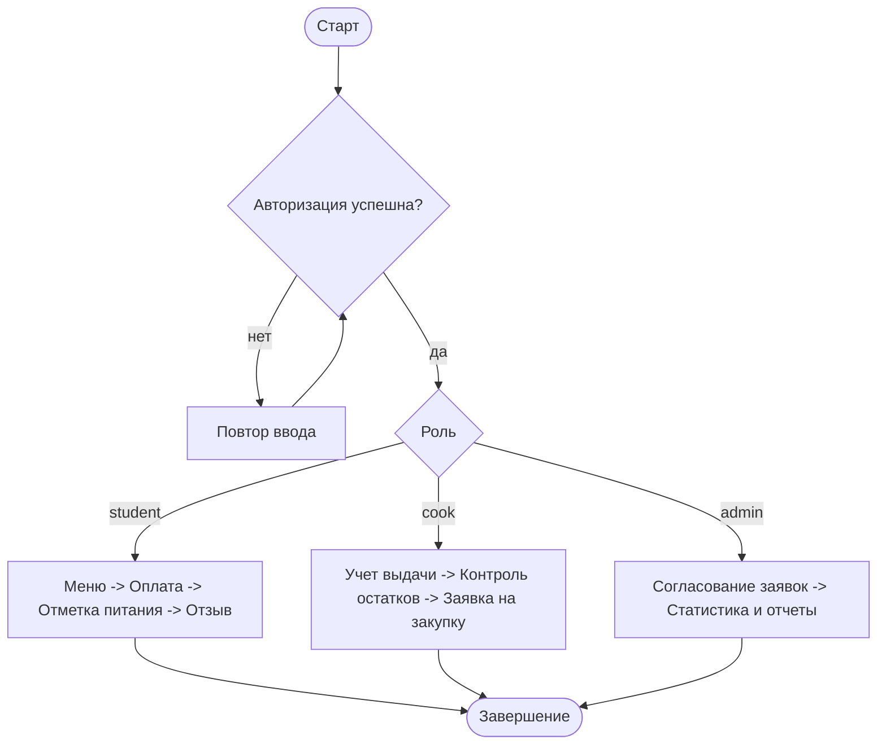

# Полный текст кейса

## Кейс

**Московская предпрофессиональная олимпиада школьников 2025/2026**  
Профиль: **Информационные технологии**  
Командный кейс №2: **«Управление столовой»**

## 1. Титульный блок

- Название команды: `<вставить>`
- Участники: `<ФИО 1>`, `<ФИО 2>`, `<ФИО 3>`
- Школа: `<номер школы>`
- Руководитель: `<ФИО руководителя>`

## 2. Постановка задачи

Цель проекта: создать веб-приложение для автоматизации процессов школьного питания с разделением доступа по ролям:
- ученик;
- повар;
- администратор.

Обязательные задачи:
- регистрация/авторизация;
- просмотр меню и оплата;
- отметка получения питания;
- учет выдачи блюд и контроль остатков;
- заявки на закупки и их согласование;
- формирование отчетности.

## 3. Обоснование выбранных технологий

- **Python + Flask**: быстрый старт, понятная архитектура, низкий порог поддержки.
- **SQLite**: легкая установка без отдельного сервера БД, подходит для MVP и демонстрации.
- **Jinja2 + HTML/CSS**: простая и быстрая реализация интерфейса для регламентных сценариев.
- **Git + GitHub**: контроль версий, прозрачность командной разработки и демонстрация прогресса.

## 4. Архитектура и функциональная схема

Приложение реализовано по клиент-серверной модели.



Функциональные модули:
- модуль авторизации и ролей;
- модуль меню и оплаты;
- модуль учета получения питания;
- модуль кухни (выдача + склад + закупки);
- модуль администрирования и отчетов.

## 5. Блок-схема основного алгоритма (пользовательский цикл)



## 6. Выбор и особенности СУБД

Выбрана **SQLite** из-за:
- нулевой стоимости развертывания;
- простого резервного копирования;
- достаточной производительности для учебного кейса;
- минимальных инфраструктурных рисков в условиях ограниченного времени.

Ограничения:
- при масштабировании до большого числа одновременных пользователей рекомендуется переход на PostgreSQL.

## 7. Схема базы данных

Основные таблицы:
- `users` — пользователи и роли;
- `menu_items` — позиции меню;
- `payments` — операции оплаты;
- `meal_claims` — отметки получения питания;
- `meal_issues` — учет выдачи блюд поваром;
- `inventory` — складские остатки;
- `purchase_requests` — заявки на закупку;
- `feedback` — отзывы учеников.

Ключевые связи:
- `payments.user_id -> users.id`
- `meal_claims.user_id -> users.id`
- `meal_claims.menu_item_id -> menu_items.id`
- `meal_issues.cook_id -> users.id`
- `meal_issues.menu_item_id -> menu_items.id`
- `purchase_requests.cook_id -> users.id`
- `purchase_requests.reviewed_by -> users.id`
- `feedback.user_id -> users.id`
- `feedback.menu_item_id -> menu_items.id`

## 8. Реализованные сценарии (по регламенту испытаний)

1. Регистрация и авторизация пользователей.
2. Оплата учеником: разовый платеж и абонемент.
3. Отметка получения питания учеником.
4. Учет выданных блюд поваром.
5. Добавление заявки на закупку поваром.
6. Согласование заявки администратором.
7. Формирование отчета администратором.
8. Обработка исключений:
   - запрет повторной отметки питания;
   - ошибка при недостатке продуктов/блюд.

## 9. Качество и безопасность

- хранение паролей в виде хешей;
- разграничение доступа по ролям;
- блокировка несанкционированных действий (`403`);
- базовая валидация пользовательского ввода.

## 10. Инструкция по запуску

```bash
python3 -m pip install --user --break-system-packages -r requirements.txt
python3 app.py
```

URL: `http://127.0.0.1:5000/login`

Демо-аккаунты:
- `admin@predprof.local / admin123`
- `cook@predprof.local / cook123`
- `student@predprof.local / student123`

## 11. Ссылка на репозиторий

- GitHub: `https://github.com/Pelmeshka126/Predprof-case2-canteen`

## 12. Ссылка на видеоролик

- `<вставить ссылку на VK/Rutube>`

## 13. Использованные официальные источники

- Практические кейсы ИТ (2025/2026): https://predprof.olimpiada.ru/tasks/inf
- Регламент олимпиады (2025/2026): https://predprof.olimpiada.ru/reglament
- Новость по командной регистрации и участию: https://predprof.olimpiada.ru/news/363
